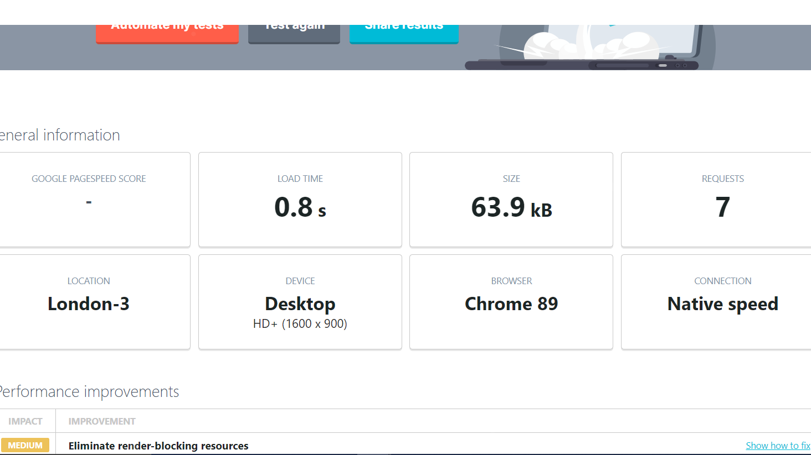

# Who are you???

## Desciption

This is a question and answer based quiz, my daughter loves playing these games and discovering different characters. The aim of the game is to find out which character you best represent based on the answers you give. It is an extremley simple game but is made for everyone to play and enjoy.

## User Stories

As a user I want :

- To play a Question game, that gives you a response.
- To easily understand how to navigate correctly.
- Interact with the website.
- To be simple and and easy to understand.
- To be able to play on any device.

## Deployment and Live page

The site has been deployed to github and is accessible on [Github Pages](https://github.com/alc232/Who-are-You)
>
## Wireframe

I have drafted up a wireframe using Figma. The design was and is very basic as I wanted to focus solely on the functionality!
This can be found [here](https://github.com/alc232/Who-are-You/tree/master/wirefame)
>

## Design 

The game was designed to be challenging fun and interactive to people of all ages.  The game is based of popular superhero characters, making it engaging with children and adults alike. The colours are consistent and designed in a way that is easy to read and use.

## Features To be added

The game will have features added in the future, a selection of different characters that can be "won". Also you will be able to determine the gender of the character based on the information you provide.
- More character options will be available.
- More questions to keep the user engaged for longer.
- Theme music will be played when the "character" is displayed.

## Languages and Technologies

### HTML

### CSS 

### Javascript
>

## Testing
- Prototype code was written and tested using jasmine
- All code used on the site has been tested to ensure everything is working as expected
- Site viewed and tested in the following browsers:
  - Google Chrome
  - Microsoft Edge
  - Mozilla Firefox

  I also tested on mobile devices and tablets such as:

  - Oppo reno 2z
  - I phone12 pro
  - Google pixel
  - Huawei p40
  - I pad 
  - Samsung Galaxy note
>

## Deployment

GitHub Pages
The project was deployed to GitHub Pages using the following steps...

- Log in to GitHub and locate the [Github Repository](https://github.com/alc232/Who-are-You)
At the top of the Repository (not top of page), locate the "Settings" Button on the menu.

- Alternatively Click Here for a GIF demonstrating the process starting from Step 2.

- Scroll down the Settings page until you locate the "GitHub Pages" Section.

- Under "Source", click the dropdown called "None" and select "Master Branch".
- The page will automatically refresh.
- Scroll back down through the page to locate the now published site link in the "GitHub Pages" section.
>
## Credits

All images were taken from google.

The speed of the page was tested here at [UpTrends](https://www.uptrends.com/tools/website-speed-test)

I used [w3c](https://www.w3.org/) to test the HTML and CSS.

# Acknowledgements

I would like to thank my mentor [Felipe Alarcon](https://github.com/felipe-alarcon) for the patience and willing to try and help. Also I would like to thank everyone at code institute. Ive really struggled with the understanding of JS portion of the course and they have been patient.

Tutor support have been fantastic in this learning process for me. Giving me great 'nudges' in the right direction and keeping me motivated even when I felt all hope was lost. This will be a continuous journey of learning and one I hope comes a lot easier in the future!
